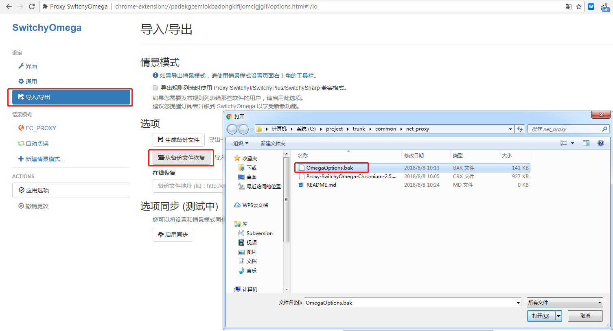
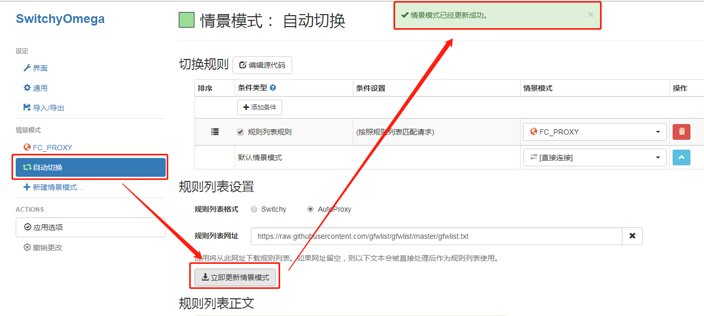
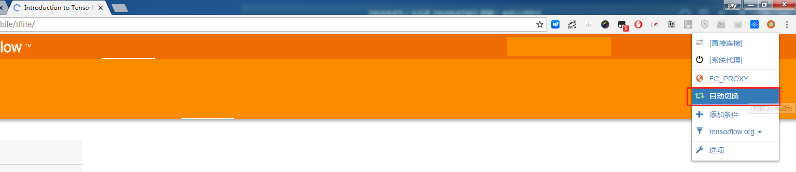

# Proxy
a tools for over the wall
# 这个插件只支持Chrome浏览器，其它浏览器请绕开
## 1 下载插件文件
将`roxy-SwitchyOmega-Chromium-2.5.15.crx` 和 `OmegaOptions.bak` 下载到本地备用
## 2 配置Chrome
1、 在chrome地址栏中输入`chrome://extensions/` 

2、 将下载的`Proxy-SwitchyOmega-Chromium-2.5.15.crx` 拖到当前页面，添加扩展程序

3、 在switchyOmega的配置页面中点击导入/导出 → 从备份文件恢复 选择下载的 `OmegaOptions.bak`

4、 在switchyOmega的配置页面中点击`自动切换` → `立即更新情景模式`，如果提示更新成功则代表配置成功

5、 随意打开一个网页，点击`SwitchyOmega`的图标，选择`自动切换`这时候不能打开的网页也能打开了

